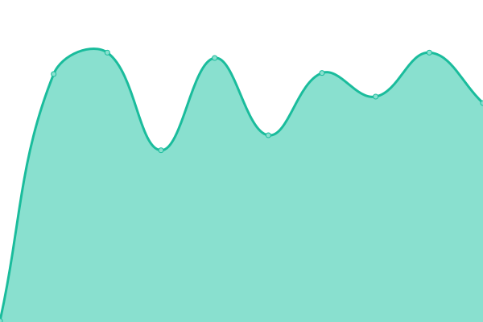
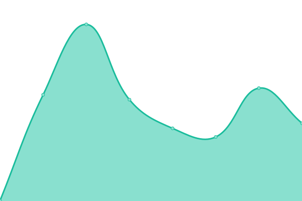
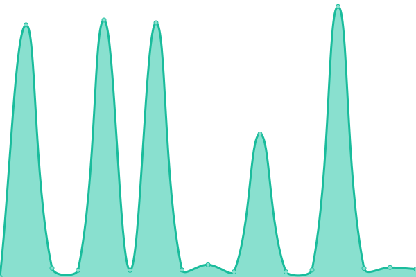

# [📈 Live Status](https://status.dink.cf): <!--live status--> **🟧 Partial outage**

This repository contains the open-source uptime monitor and status page for [Moonlight Studios](https://url.dink.cf/), powered by [Upptime](https://github.com/upptime/upptime).

With [Upptime](https://upptime.js.org), you can get your own unlimited and free uptime monitor and status page, powered entirely by a GitHub repository. We use [Issues](https://github.com/MoonlightStudiosInt/status/issues) as incident reports, [Actions](https://github.com/MoonlightStudiosInt/status/actions) as uptime monitors, and [Pages](https://status.dink.cf) for the status page.

<!--start: status pages-->
<!-- This summary is generated by Upptime (https://github.com/upptime/upptime) -->
<!-- Do not edit this manually, your changes will be overwritten -->
<!-- prettier-ignore -->
| URL | Status | History | Response Time | Uptime |
| --- | ------ | ------- | ------------- | ------ |
|  [Website](https://www.fullmoon.dev/) | 🟩 Up | [website.yml](https://github.com/fullmoondev/status/commits/HEAD/history/website.yml) | 

 285ms
     
 | 

<a href="https://status.fullmoon.dev/history/website">100.00%</a>
    

|  [Accounts](https://www.fullmoon.dev/accounts/) | 🟩 Up | [accounts.yml](https://github.com/fullmoondev/status/commits/HEAD/history/accounts.yml) | 

 80ms
     
 | 

<a href="https://status.fullmoon.dev/history/accounts">100.00%</a>
    

|  [Help Desk](https://www.fullmoon.dev/help/) | 🟩 Up | [help-desk.yml](https://github.com/fullmoondev/status/commits/HEAD/history/help-desk.yml) | 

 98ms
     
 | 

<a href="https://status.fullmoon.dev/history/help-desk">100.00%</a>
    

|  [Protected](https://protected.fullmoon.dev/) | 🟩 Up | [protected.yml](https://github.com/fullmoondev/status/commits/HEAD/history/protected.yml) | 

 531ms
     
 | 

<a href="https://status.fullmoon.dev/history/protected">100.00%</a>
    

|  [Profile API](https://profile.live.net.co/info) | 🟩 Up | [profile-api.yml](https://github.com/fullmoondev/status/commits/HEAD/history/profile-api.yml) | 

 363ms
     
 | 

<a href="https://status.fullmoon.dev/history/profile-api">100.00%</a>
    

|  [Online Live Service API](https://ols.live.net.co/info) | 🟩 Up | [online-live-service-api.yml](https://github.com/fullmoondev/status/commits/HEAD/history/online-live-service-api.yml) | 

 374ms
     
 | 

<a href="https://status.fullmoon.dev/history/online-live-service-api">100.00%</a>
    

|  [Live Store Assets](https://apollo.fullmoon.dev/) | 🟩 Up | [live-store-assets.yml](https://github.com/fullmoondev/status/commits/HEAD/history/live-store-assets.yml) | 

 360ms
     
 | 

<a href="https://status.fullmoon.dev/history/live-store-assets">100.00%</a>
    

|  [Live Store API](https://store-api.live.net.co/info) | 🟩 Up | [live-store-api.yml](https://github.com/fullmoondev/status/commits/HEAD/history/live-store-api.yml) | 

 287ms
     
 | 

<a href="https://status.fullmoon.dev/history/live-store-api">100.00%</a>
    

|  [Live Store Ruby CDN](https://ruby.cdn.apollo.fullmoon.dev/) | 🟩 Up | [live-store-ruby-cdn.yml](https://github.com/fullmoondev/status/commits/HEAD/history/live-store-ruby-cdn.yml) | 

 346ms
     
 | 

<a href="https://status.fullmoon.dev/history/live-store-ruby-cdn">100.00%</a>
    

|  [Global Assets](https://assets.fullmoon.dev/) | 🟩 Up | [global-assets.yml](https://github.com/fullmoondev/status/commits/HEAD/history/global-assets.yml) | 

 227ms
     
 | 

<a href="https://status.fullmoon.dev/history/global-assets">100.00%</a>
    

|  [Global CDN](https://c.live.net.co/) | 🟩 Up | [global-cdn.yml](https://github.com/fullmoondev/status/commits/HEAD/history/global-cdn.yml) | 

 122ms
     
 | 

<a href="https://status.fullmoon.dev/history/global-cdn">100.00%</a>
    

|  [Waddle Penguins Island - Website](https://waddlepenguins.me/) | 🟩 Up | [waddle-penguins-island-website.yml](https://github.com/fullmoondev/status/commits/HEAD/history/waddle-penguins-island-website.yml) | 

 490ms
     
 | 

<a href="https://status.fullmoon.dev/history/waddle-penguins-island-website">100.00%</a>
    

|  [Waddle Penguins Island - API](https://api.waddlepenguins.me/) | 🟥 Down | [waddle-penguins-island-api.yml](https://github.com/fullmoondev/status/commits/HEAD/history/waddle-penguins-island-api.yml) | 

 253ms
     
 | 

<a href="https://status.fullmoon.dev/history/waddle-penguins-island-api">41.73%</a>
    

|  Waddle Penguins Island - Game Server | 🟥 Down | [waddle-penguins-island-game-server.yml](https://github.com/fullmoondev/status/commits/HEAD/history/waddle-penguins-island-game-server.yml) | 

 84ms
     
 | 

<a href="https://status.fullmoon.dev/history/waddle-penguins-island-game-server">41.66%</a>
    

|  [Waddle Penguins Island - Content](https://cdn.waddlepenguins.me/) | 🟩 Up | [waddle-penguins-island-content.yml](https://github.com/fullmoondev/status/commits/HEAD/history/waddle-penguins-island-content.yml) | 

 250ms
     
 | 

<a href="https://status.fullmoon.dev/history/waddle-penguins-island-content">100.00%</a>
    

|  [Waddle Penguins Island - Content CDN](https://wpi2.cdn.dink.cf/) | 🟩 Up | [waddle-penguins-island-content-cdn.yml](https://github.com/fullmoondev/status/commits/HEAD/history/waddle-penguins-island-content-cdn.yml) | 

 323ms
     
 | 

<a href="https://status.fullmoon.dev/history/waddle-penguins-island-content-cdn">100.00%</a>
    

|  [Club Penguin Atake - Website](https://cpatake.boo/) | 🟩 Up | [club-penguin-atake-website.yml](https://github.com/fullmoondev/status/commits/HEAD/history/club-penguin-atake-website.yml) | 

 467ms
     
 | 

<a href="https://status.fullmoon.dev/history/club-penguin-atake-website">100.00%</a>
    

|  [Club Penguin Atake - AS1](https://as1.cpatake.boo/) | 🟩 Up | [club-penguin-atake-as-1.yml](https://github.com/fullmoondev/status/commits/HEAD/history/club-penguin-atake-as-1.yml) | 

 245ms
     
 | 

<a href="https://status.fullmoon.dev/history/club-penguin-atake-as-1">99.94%</a>
    

|  [Club Penguin Atake - AS2](https://as2.cpatake.boo/) | 🟩 Up | [club-penguin-atake-as-2.yml](https://github.com/fullmoondev/status/commits/HEAD/history/club-penguin-atake-as-2.yml) | 

 235ms
     
 | 

<a href="https://status.fullmoon.dev/history/club-penguin-atake-as-2">99.94%</a>
    

|  [Club Penguin Atake - AS3](https://as3.cpatake.boo/) | 🟩 Up | [club-penguin-atake-as-3.yml](https://github.com/fullmoondev/status/commits/HEAD/history/club-penguin-atake-as-3.yml) | 

 229ms
     
 | 

<a href="https://status.fullmoon.dev/history/club-penguin-atake-as-3">100.00%</a>
    

|  [Club Penguin Atake - App](https://app.cpatake.boo/) | 🟩 Up | [club-penguin-atake-app.yml](https://github.com/fullmoondev/status/commits/HEAD/history/club-penguin-atake-app.yml) | 

 253ms
     
 | 

<a href="https://status.fullmoon.dev/history/club-penguin-atake-app">100.00%</a>
    

|  [Club Penguin Atake TV](https://tv.cpatake.boo/) | 🟩 Up | [club-penguin-atake-tv.yml](https://github.com/fullmoondev/status/commits/HEAD/history/club-penguin-atake-tv.yml) | 

 269ms
     
 | 

<a href="https://status.fullmoon.dev/history/club-penguin-atake-tv">100.00%</a>
    

|  [Club Penguin Atake Web Services](https://webservice.cpatake.boo/) | 🟩 Up | [club-penguin-atake-web-services.yml](https://github.com/fullmoondev/status/commits/HEAD/history/club-penguin-atake-web-services.yml) | 

 297ms
     
 | 

<a href="https://status.fullmoon.dev/history/club-penguin-atake-web-services">100.00%</a>
    

|  [Club Penguin Atake TV - Video CDN](https://cdn.tv.cpatake.boo/) | 🟩 Up | [club-penguin-atake-tv-video-cdn.yml](https://github.com/fullmoondev/status/commits/HEAD/history/club-penguin-atake-tv-video-cdn.yml) | 

 231ms
     
 | 

<a href="https://status.fullmoon.dev/history/club-penguin-atake-tv-video-cdn">100.00%</a>
    

|  [Club Penguin Atake - Legacy CDN](https://legacy.cdn.cpatake.tk/) | 🟩 Up | [club-penguin-atake-legacy-cdn.yml](https://github.com/fullmoondev/status/commits/HEAD/history/club-penguin-atake-legacy-cdn.yml) | 

 640ms
     
 | 

<a href="https://status.fullmoon.dev/history/club-penguin-atake-legacy-cdn">100.00%</a>
    

|  [Club Penguin Atake - Vanilla CDN](https://vanilla.cdn.cpatake.tk/) | 🟩 Up | [club-penguin-atake-vanilla-cdn.yml](https://github.com/fullmoondev/status/commits/HEAD/history/club-penguin-atake-vanilla-cdn.yml) | 

 230ms
     
 | 

<a href="https://status.fullmoon.dev/history/club-penguin-atake-vanilla-cdn">100.00%</a>
    

|  [Club Penguin Atake - Antique CDN](https://antique.cdn.cpatake.tk/) | 🟩 Up | [club-penguin-atake-antique-cdn.yml](https://github.com/fullmoondev/status/commits/HEAD/history/club-penguin-atake-antique-cdn.yml) | 

 361ms
     
 | 

<a href="https://status.fullmoon.dev/history/club-penguin-atake-antique-cdn">100.00%</a>
    

|  [Club Penguin Atake - Experimental Penguins](https://ep.cpatake.boo/) | 🟩 Up | [club-penguin-atake-experimental-penguins.yml](https://github.com/fullmoondev/status/commits/HEAD/history/club-penguin-atake-experimental-penguins.yml) | 

 186ms
     
 | 

<a href="https://status.fullmoon.dev/history/club-penguin-atake-experimental-penguins">100.00%</a>
    

|  [Club Penguin Atake - Penguin Chat](https://pc.cpatake.boo/) | 🟩 Up | [club-penguin-atake-penguin-chat.yml](https://github.com/fullmoondev/status/commits/HEAD/history/club-penguin-atake-penguin-chat.yml) | 

 199ms
     
 | 

<a href="https://status.fullmoon.dev/history/club-penguin-atake-penguin-chat">100.00%</a>
    

|  [Club Penguin Atake - Penguin Chat 3](https://pc3.cpatake.boo/) | 🟩 Up | [club-penguin-atake-penguin-chat-3.yml](https://github.com/fullmoondev/status/commits/HEAD/history/club-penguin-atake-penguin-chat-3.yml) | 

 201ms
     
 | 

<a href="https://status.fullmoon.dev/history/club-penguin-atake-penguin-chat-3">100.00%</a>
    

|  [Club Penguin Atake - Profile](https://profile.cpatake.boo/) | 🟩 Up | [club-penguin-atake-profile.yml](https://github.com/fullmoondev/status/commits/HEAD/history/club-penguin-atake-profile.yml) | 

 5738ms
     
 | 

<a href="https://status.fullmoon.dev/history/club-penguin-atake-profile">99.83%</a>
    

<!--end: status pages-->

[**Visit our status website →**](https://status.dink.cf)

## 📄 License

- Powered by: [Upptime](https://github.com/upptime/upptime)
- Code: [MIT](./LICENSE) © [Moonlight Studios](https://url.dink.cf/)
- Data in the `./history` directory: [Open Database License](https://opendatacommons.org/licenses/odbl/1-0/)
