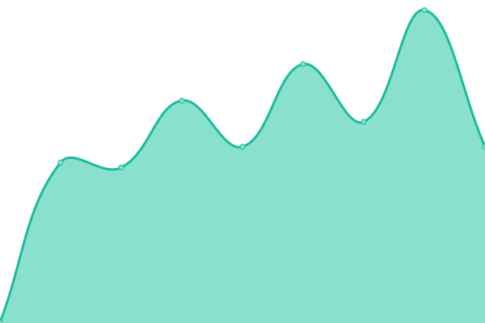

# [📈 Live Status](https://status.dink.cf): <!--live status--> **🟩 All systems operational**

This repository contains the open-source uptime monitor and status page for [Moonlight Studios](https://url.dink.cf/), powered by [Upptime](https://github.com/upptime/upptime).

With [Upptime](https://upptime.js.org), you can get your own unlimited and free uptime monitor and status page, powered entirely by a GitHub repository. We use [Issues](https://github.com/MoonlightStudiosInt/status/issues) as incident reports, [Actions](https://github.com/MoonlightStudiosInt/status/actions) as uptime monitors, and [Pages](https://status.dink.cf) for the status page.

<!--start: status pages-->
<!-- This summary is generated by Upptime (https://github.com/upptime/upptime) -->
<!-- Do not edit this manually, your changes will be overwritten -->
<!-- prettier-ignore -->
| URL | Status | History | Response Time | Uptime |
| --- | ------ | ------- | ------------- | ------ |
|  [Waddle Penguins Island - Website](https://waddlepenguins.me/) | 🟩 Up | [waddle-penguins-island-website.yml](https://github.com/MoonlightStudiosInt/status/commits/HEAD/history/waddle-penguins-island-website.yml) | 

 195ms
     
 | 

<a href="https://status.dink.cf/history/waddle-penguins-island-website">80.54%</a>
    

|  [Waddle Penguins Island - API](https://api.waddlepenguins.me/) | 🟩 Up | [waddle-penguins-island-api.yml](https://github.com/MoonlightStudiosInt/status/commits/HEAD/history/waddle-penguins-island-api.yml) | 

 275ms
     
 | 

<a href="https://status.dink.cf/history/waddle-penguins-island-api">79.79%</a>
    

|  Waddle Penguins Island - Game Server | 🟩 Up | [waddle-penguins-island-game-server.yml](https://github.com/MoonlightStudiosInt/status/commits/HEAD/history/waddle-penguins-island-game-server.yml) | 

 109ms
     
 | 

<a href="https://status.dink.cf/history/waddle-penguins-island-game-server">88.90%</a>
    

|  [Waddle Penguins Island - Content](https://cdn.waddlepenguins.me/) | 🟩 Up | [waddle-penguins-island-content.yml](https://github.com/MoonlightStudiosInt/status/commits/HEAD/history/waddle-penguins-island-content.yml) | 

 601ms
     
 | 

<a href="https://status.dink.cf/history/waddle-penguins-island-content">76.64%</a>
    

|  [Files 3 Server](https://files3.dink.cf/) | 🟩 Up | [files-3-server.yml](https://github.com/MoonlightStudiosInt/status/commits/HEAD/history/files-3-server.yml) | 

 387ms
     
 | 

<a href="https://status.dink.cf/history/files-3-server">100.00%</a>
    

|  [Files 5 Server](https://files5.dink.cf/) | 🟩 Up | [files-5-server.yml](https://github.com/MoonlightStudiosInt/status/commits/HEAD/history/files-5-server.yml) | 

 373ms
     
 | 

<a href="https://status.dink.cf/history/files-5-server">100.00%</a>
    

|  [Moonlight Studios Archive](https://archive.dink.cf/) | 🟩 Up | [moonlight-studios-archive.yml](https://github.com/MoonlightStudiosInt/status/commits/HEAD/history/moonlight-studios-archive.yml) | 

 379ms
     
 | 

<a href="https://status.dink.cf/history/moonlight-studios-archive">100.00%</a>
    

|  [Club Penguin Atake - Website](https://cpatake.dink.cf/) | 🟩 Up | [club-penguin-atake-website.yml](https://github.com/MoonlightStudiosInt/status/commits/HEAD/history/club-penguin-atake-website.yml) | 

 304ms
     
 | 

<a href="https://status.dink.cf/history/club-penguin-atake-website">100.00%</a>
    

|  [Club Penguin Atake - AS1](https://as1-cpa.dink.cf/) | 🟩 Up | [club-penguin-atake-as-1.yml](https://github.com/MoonlightStudiosInt/status/commits/HEAD/history/club-penguin-atake-as-1.yml) | 

 304ms
     
 | 

<a href="https://status.dink.cf/history/club-penguin-atake-as-1">100.00%</a>
    

|  [Club Penguin Atake - AS2](https://as2-cpa.dink.cf/) | 🟩 Up | [club-penguin-atake-as-2.yml](https://github.com/MoonlightStudiosInt/status/commits/HEAD/history/club-penguin-atake-as-2.yml) | 

 389ms
     
 | 

<a href="https://status.dink.cf/history/club-penguin-atake-as-2">100.00%</a>
    

|  [Club Penguin Atake - AS2 (CC)](https://web.cpatake.dink.cf/cppscreator) | 🟩 Up | [club-penguin-atake-as-2-cc.yml](https://github.com/MoonlightStudiosInt/status/commits/HEAD/history/club-penguin-atake-as-2-cc.yml) | 

 329ms
     
 | 

<a href="https://status.dink.cf/history/club-penguin-atake-as-2-cc">100.00%</a>
    

|  [Club Penguin Atake - AS3](https://as3-cpa.dink.cf/) | 🟩 Up | [club-penguin-atake-as-3.yml](https://github.com/MoonlightStudiosInt/status/commits/HEAD/history/club-penguin-atake-as-3.yml) | 

 356ms
     
 | 

<a href="https://status.dink.cf/history/club-penguin-atake-as-3">100.00%</a>
    

|  Club Penguin Atake - Client 4.0 | 🟩 Up | [club-penguin-atake-client-4-0.yml](https://github.com/MoonlightStudiosInt/status/commits/HEAD/history/club-penguin-atake-client-4-0.yml) | 

 251ms
     
 | 

<a href="https://status.dink.cf/history/club-penguin-atake-client-4-0">100.00%</a>
    

|  [Club Penguin Atake - Web Client](https://web.cpatake.dink.cf/) | 🟩 Up | [club-penguin-atake-web-client.yml](https://github.com/MoonlightStudiosInt/status/commits/HEAD/history/club-penguin-atake-web-client.yml) | 

 98ms
     
 | 

<a href="https://status.dink.cf/history/club-penguin-atake-web-client">100.00%</a>
    

|  [Club Penguin Atake TV](https://cpataketv.dink.cf/) | 🟩 Up | [club-penguin-atake-tv.yml](https://github.com/MoonlightStudiosInt/status/commits/HEAD/history/club-penguin-atake-tv.yml) | 

 249ms
     
 | 

<a href="https://status.dink.cf/history/club-penguin-atake-tv">100.00%</a>
    

|  [Club Penguin Atake TV Video CDN](https://cdn.cpataketv.dink.cf/) | 🟩 Up | [club-penguin-atake-tv-video-cdn.yml](https://github.com/MoonlightStudiosInt/status/commits/HEAD/history/club-penguin-atake-tv-video-cdn.yml) | 

 115ms
     
 | 

<a href="https://status.dink.cf/history/club-penguin-atake-tv-video-cdn">100.00%</a>
    

|  [Club Penguin Atake TV Edge Captions](https://captions.cpataketv.dink.cf/) | 🟩 Up | [club-penguin-atake-tv-edge-captions.yml](https://github.com/MoonlightStudiosInt/status/commits/HEAD/history/club-penguin-atake-tv-edge-captions.yml) | 

 251ms
     
 | 

<a href="https://status.dink.cf/history/club-penguin-atake-tv-edge-captions">100.00%</a>
    

|  [Club Penguin Elemental](https://cpelemental.dink.cf/) | 🟩 Up | [club-penguin-elemental.yml](https://github.com/MoonlightStudiosInt/status/commits/HEAD/history/club-penguin-elemental.yml) | 

 198ms
     
 | 

<a href="https://status.dink.cf/history/club-penguin-elemental">100.00%</a>
    

|  [Club Penguin Elemental AS2](https://as2-cpe.dink.cf/) | 🟩 Up | [club-penguin-elemental-as-2.yml](https://github.com/MoonlightStudiosInt/status/commits/HEAD/history/club-penguin-elemental-as-2.yml) | 

 562ms
     
 | 

<a href="https://status.dink.cf/history/club-penguin-elemental-as-2">100.00%</a>
    

<!--end: status pages-->

[**Visit our status website →**](https://status.dink.cf)

## 📄 License

- Powered by: [Upptime](https://github.com/upptime/upptime)
- Code: [MIT](./LICENSE) © [Moonlight Studios](https://url.dink.cf/)
- Data in the `./history` directory: [Open Database License](https://opendatacommons.org/licenses/odbl/1-0/)
