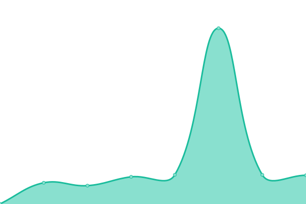

# [📈 Live Status](https://status.fullmoon.dev): <!--live status--> **🟧 Partial outage**

This repository contains the open-source uptime monitor and status page for One Live Interactive, powered by [Upptime](https://github.com/upptime/upptime).

With [Upptime](https://upptime.js.org), you can get your own unlimited and free uptime monitor and status page, powered entirely by a GitHub repository. We use [Issues](https://github.com/MoonlightStudiosInt/status/issues) as incident reports, [Actions](https://github.com/MoonlightStudiosInt/status/actions) as uptime monitors, and [Pages](https://status.dink.cf) for the status page.

<!--start: status pages-->
<!-- This summary is generated by Upptime (https://github.com/upptime/upptime) -->
<!-- Do not edit this manually, your changes will be overwritten -->
<!-- prettier-ignore -->
| URL | Status | History | Response Time | Uptime |
| --- | ------ | ------- | ------------- | ------ |
|  [Website](https://www.onelive.me/) | 🟩 Up | [website.yml](https://github.com/oneliveme/status/commits/HEAD/history/website.yml) | 

 121ms
     
 | 

<a href="https://status.fullmoon.dev/history/website">100.00%</a>
    

|  [Help Desk](https://www.onelive.me/help/) | 🟩 Up | [help-desk.yml](https://github.com/oneliveme/status/commits/HEAD/history/help-desk.yml) | 

 112ms
     
 | 

<a href="https://status.fullmoon.dev/history/help-desk">100.00%</a>
    

|  [Protected](https://protected.fullmoon.dev/) | 🟩 Up | [protected.yml](https://github.com/oneliveme/status/commits/HEAD/history/protected.yml) | 

 571ms
     
 | 

<a href="https://status.fullmoon.dev/history/protected">100.00%</a>
    

|  [One Live ID Service](https://id.live.net.co/) | 🟩 Up | [one-live-id-service.yml](https://github.com/oneliveme/status/commits/HEAD/history/one-live-id-service.yml) | 

 1182ms
     
 | 

<a href="https://status.fullmoon.dev/history/one-live-id-service">100.00%</a>
    

|  [Profile API](https://profile.live.net.co/info) | 🟩 Up | [profile-api.yml](https://github.com/oneliveme/status/commits/HEAD/history/profile-api.yml) | 

 540ms
     
 | 

<a href="https://status.fullmoon.dev/history/profile-api">100.00%</a>
    

|  [Online Live Service API](https://ols.live.net.co/info) | 🟩 Up | [online-live-service-api.yml](https://github.com/oneliveme/status/commits/HEAD/history/online-live-service-api.yml) | 

 958ms
     
 | 

<a href="https://status.fullmoon.dev/history/online-live-service-api">100.00%</a>
    

|  [Live Store Website](https://store.live.net.co/) | 🟩 Up | [live-store-website.yml](https://github.com/oneliveme/status/commits/HEAD/history/live-store-website.yml) | 

 446ms
     
 | 

<a href="https://status.fullmoon.dev/history/live-store-website">100.00%</a>
    

|  [Live Store Dev Center](https://store-dev.live.net.co/) | 🟩 Up | [live-store-dev-center.yml](https://github.com/oneliveme/status/commits/HEAD/history/live-store-dev-center.yml) | 

 385ms
     
 | 

<a href="https://status.fullmoon.dev/history/live-store-dev-center">100.00%</a>
    

|  [Live Store Assets](https://apollo.fullmoon.dev/) | 🟩 Up | [live-store-assets.yml](https://github.com/oneliveme/status/commits/HEAD/history/live-store-assets.yml) | 

 434ms
     
 | 

<a href="https://status.fullmoon.dev/history/live-store-assets">100.00%</a>
    

|  [Live Store API](https://store-api.live.net.co/info) | 🟩 Up | [live-store-api.yml](https://github.com/oneliveme/status/commits/HEAD/history/live-store-api.yml) | 

 599ms
     
 | 

<a href="https://status.fullmoon.dev/history/live-store-api">100.00%</a>
    

|  [Live Store Legacy Ruby CDN](https://legacy.ls.olcdns.com/) | 🟩 Up | [live-store-legacy-ruby-cdn.yml](https://github.com/oneliveme/status/commits/HEAD/history/live-store-legacy-ruby-cdn.yml) | 

 436ms
     
 | 

<a href="https://status.fullmoon.dev/history/live-store-legacy-ruby-cdn">99.01%</a>
    

|  [Live Store CDN1](https://pl1.ls.olcdns.com/) | 🟩 Up | [live-store-cdn-1.yml](https://github.com/oneliveme/status/commits/HEAD/history/live-store-cdn-1.yml) | 

 103ms
     
 | 

<a href="https://status.fullmoon.dev/history/live-store-cdn-1">99.02%</a>
    

|  [Global Assets](https://assets.fullmoon.dev/) | 🟩 Up | [global-assets.yml](https://github.com/oneliveme/status/commits/HEAD/history/global-assets.yml) | 

 165ms
     
 | 

<a href="https://status.fullmoon.dev/history/global-assets">100.00%</a>
    

|  [Global CDN](https://edge.live.net.co/) | 🟩 Up | [global-cdn.yml](https://github.com/oneliveme/status/commits/HEAD/history/global-cdn.yml) | 

 399ms
     
 | 

<a href="https://status.fullmoon.dev/history/global-cdn">100.00%</a>
    

|  [Club Penguin Atake - Website](https://www.cpatake.boo/) | 🟩 Up | [club-penguin-atake-website.yml](https://github.com/oneliveme/status/commits/HEAD/history/club-penguin-atake-website.yml) | 

 180ms
     
 | 

<a href="https://status.fullmoon.dev/history/club-penguin-atake-website">100.00%</a>
    

|  [Club Penguin Atake - AS1](https://as1.cpatake.boo/) | 🟩 Up | [club-penguin-atake-as-1.yml](https://github.com/oneliveme/status/commits/HEAD/history/club-penguin-atake-as-1.yml) | 

 394ms
     
 | 

<a href="https://status.fullmoon.dev/history/club-penguin-atake-as-1">100.00%</a>
    

|  [Club Penguin Atake - AS2](https://as2.cpatake.boo/) | 🟩 Up | [club-penguin-atake-as-2.yml](https://github.com/oneliveme/status/commits/HEAD/history/club-penguin-atake-as-2.yml) | 

 488ms
     
 | 

<a href="https://status.fullmoon.dev/history/club-penguin-atake-as-2">100.00%</a>
    

|  [Club Penguin Atake - AS3](https://as3.cpatake.boo/) | 🟩 Up | [club-penguin-atake-as-3.yml](https://github.com/oneliveme/status/commits/HEAD/history/club-penguin-atake-as-3.yml) | 

 632ms
     
 | 

<a href="https://status.fullmoon.dev/history/club-penguin-atake-as-3">100.00%</a>
    

|  [Club Penguin Atake - App](https://app.cpatake.boo/) | 🟩 Up | [club-penguin-atake-app.yml](https://github.com/oneliveme/status/commits/HEAD/history/club-penguin-atake-app.yml) | 

 171ms
     
 | 

<a href="https://status.fullmoon.dev/history/club-penguin-atake-app">100.00%</a>
    

|  [Club Penguin Atake TV](https://tv.cpatake.boo/) | 🟩 Up | [club-penguin-atake-tv.yml](https://github.com/oneliveme/status/commits/HEAD/history/club-penguin-atake-tv.yml) | 

 210ms
     
 | 

<a href="https://status.fullmoon.dev/history/club-penguin-atake-tv">100.00%</a>
    

|  [Club Penguin Atake Web Services](https://de-cf.cpatake.boo) | 🟩 Up | [club-penguin-atake-web-services.yml](https://github.com/oneliveme/status/commits/HEAD/history/club-penguin-atake-web-services.yml) | 

 573ms
     
 | 

<a href="https://status.fullmoon.dev/history/club-penguin-atake-web-services">100.00%</a>
    

|  [Club Penguin Atake Chat Services](https://chat.cpatake.boo) | 🟩 Up | [club-penguin-atake-chat-services.yml](https://github.com/oneliveme/status/commits/HEAD/history/club-penguin-atake-chat-services.yml) | 

 582ms
     
 | 

<a href="https://status.fullmoon.dev/history/club-penguin-atake-chat-services">100.00%</a>
    

|  [Club Penguin Atake Profile Services](https://profile.cpatake.boo) | 🟩 Up | [club-penguin-atake-profile-services.yml](https://github.com/oneliveme/status/commits/HEAD/history/club-penguin-atake-profile-services.yml) | 

 14257ms
     
 | 

<a href="https://status.fullmoon.dev/history/club-penguin-atake-profile-services">100.00%</a>
    

|  [Club Penguin Atake TV - Video CDN](https://cdn.tv.cpatake.boo/) | 🟩 Up | [club-penguin-atake-tv-video-cdn.yml](https://github.com/oneliveme/status/commits/HEAD/history/club-penguin-atake-tv-video-cdn.yml) | 

 139ms
     
 | 

<a href="https://status.fullmoon.dev/history/club-penguin-atake-tv-video-cdn">99.02%</a>
    

|  [Club Penguin Atake - Legacy CDN](https://legacy.cpa.olcdns.com/) | 🟩 Up | [club-penguin-atake-legacy-cdn.yml](https://github.com/oneliveme/status/commits/HEAD/history/club-penguin-atake-legacy-cdn.yml) | 

 351ms
     
 | 

<a href="https://status.fullmoon.dev/history/club-penguin-atake-legacy-cdn">99.02%</a>
    

|  [Club Penguin Atake - Vanilla CDN](https://vanilla.cpa.olcdns.com/) | 🟩 Up | [club-penguin-atake-vanilla-cdn.yml](https://github.com/oneliveme/status/commits/HEAD/history/club-penguin-atake-vanilla-cdn.yml) | 

 88ms
     
 | 

<a href="https://status.fullmoon.dev/history/club-penguin-atake-vanilla-cdn">99.02%</a>
    

|  [Club Penguin Atake - Antique CDN](https://antique.cpa.olcdns.com/) | 🟩 Up | [club-penguin-atake-antique-cdn.yml](https://github.com/oneliveme/status/commits/HEAD/history/club-penguin-atake-antique-cdn.yml) | 

 336ms
     
 | 

<a href="https://status.fullmoon.dev/history/club-penguin-atake-antique-cdn">99.03%</a>
    

|  [Club Penguin Atake - Experimental Penguins](https://ep.cpatake.boo/) | 🟩 Up | [club-penguin-atake-experimental-penguins.yml](https://github.com/oneliveme/status/commits/HEAD/history/club-penguin-atake-experimental-penguins.yml) | 

 331ms
     
 | 

<a href="https://status.fullmoon.dev/history/club-penguin-atake-experimental-penguins">100.00%</a>
    

|  [Club Penguin Atake - Penguin Chat](https://pc.cpatake.boo/) | 🟩 Up | [club-penguin-atake-penguin-chat.yml](https://github.com/oneliveme/status/commits/HEAD/history/club-penguin-atake-penguin-chat.yml) | 

 331ms
     
 | 

<a href="https://status.fullmoon.dev/history/club-penguin-atake-penguin-chat">100.00%</a>
    

|  [Club Penguin Atake - Penguin Chat 3](https://pc3.cpatake.boo/) | 🟩 Up | [club-penguin-atake-penguin-chat-3.yml](https://github.com/oneliveme/status/commits/HEAD/history/club-penguin-atake-penguin-chat-3.yml) | 

 561ms
     
 | 

<a href="https://status.fullmoon.dev/history/club-penguin-atake-penguin-chat-3">100.00%</a>
    

|  [CPI Remix - Web Service](https://ws.cpiremix.com/) | 🟩 Up | [cpi-remix-web-service.yml](https://github.com/oneliveme/status/commits/HEAD/history/cpi-remix-web-service.yml) | 

 584ms
     
 | 

<a href="https://status.fullmoon.dev/history/cpi-remix-web-service">100.00%</a>
    

|  [CPI Remix - Game Server](http://asap.cpiremix.com/) | 🟥 Down | [cpi-remix-game-server.yml](https://github.com/oneliveme/status/commits/HEAD/history/cpi-remix-game-server.yml) | 

 0ms
     
 | 

<a href="https://status.fullmoon.dev/history/cpi-remix-game-server">0.00%</a>
    

<!--end: status pages-->

[**Visit our status website →**](https://status.fullmoon.dev)

## 📄 License

- Powered by: [Upptime](https://github.com/upptime/upptime)
- Code: [MIT](./LICENSE) © One Live Interactive
- Data in the `./history` directory: [Open Database License](https://opendatacommons.org/licenses/odbl/1-0/)
