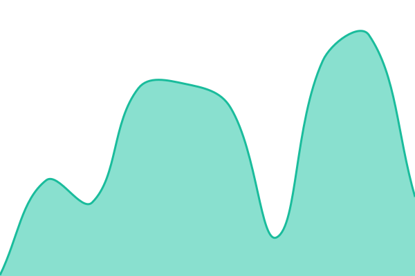
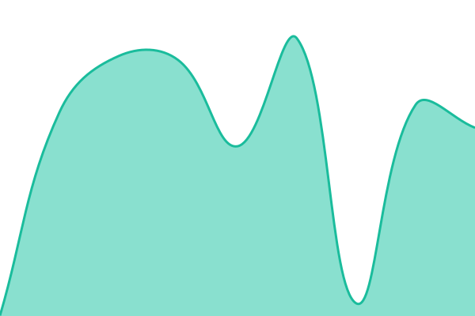
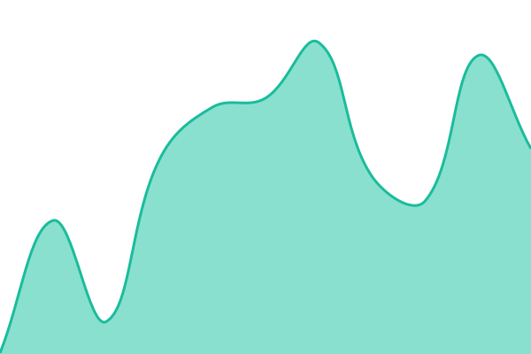

# [📈 Live Status](https://status.fullmoon.dev): <!--live status--> **🟧 Partial outage**

This repository contains the open-source uptime monitor and status page for One Live Interactive, powered by [Upptime](https://github.com/upptime/upptime).

With [Upptime](https://upptime.js.org), you can get your own unlimited and free uptime monitor and status page, powered entirely by a GitHub repository. We use [Issues](https://github.com/MoonlightStudiosInt/status/issues) as incident reports, [Actions](https://github.com/MoonlightStudiosInt/status/actions) as uptime monitors, and [Pages](https://status.dink.cf) for the status page.

<!--start: status pages-->
<!-- This summary is generated by Upptime (https://github.com/upptime/upptime) -->
<!-- Do not edit this manually, your changes will be overwritten -->
<!-- prettier-ignore -->
| URL | Status | History | Response Time | Uptime |
| --- | ------ | ------- | ------------- | ------ |
|  [Website](https://www.onelive.me/) | 🟩 Up | [website.yml](https://github.com/oneliveme/status/commits/HEAD/history/website.yml) | 

 171ms
     
 | 

<a href="https://status.fullmoon.dev/history/website">100.00%</a>
    

|  [Help Desk](https://www.onelive.me/help/) | 🟩 Up | [help-desk.yml](https://github.com/oneliveme/status/commits/HEAD/history/help-desk.yml) | 

 92ms
     
 | 

<a href="https://status.fullmoon.dev/history/help-desk">100.00%</a>
    

|  [Protected](https://protected.fullmoon.dev/) | 🟩 Up | [protected.yml](https://github.com/oneliveme/status/commits/HEAD/history/protected.yml) | 

 610ms
     
 | 

<a href="https://status.fullmoon.dev/history/protected">100.00%</a>
    

|  [One Live Developer Centre](https://dev.live.net.co/) | 🟥 Down | [one-live-developer-centre.yml](https://github.com/oneliveme/status/commits/HEAD/history/one-live-developer-centre.yml) | 

 464ms
     
 | 

<a href="https://status.fullmoon.dev/history/one-live-developer-centre">98.79%</a>
    

|  [One Live ID Service](https://id.live.net.co/) | 🟩 Up | [one-live-id-service.yml](https://github.com/oneliveme/status/commits/HEAD/history/one-live-id-service.yml) | 

 412ms
     
 | 

<a href="https://status.fullmoon.dev/history/one-live-id-service">100.00%</a>
    

|  [Profile API](https://profile.live.net.co/info) | 🟩 Up | [profile-api.yml](https://github.com/oneliveme/status/commits/HEAD/history/profile-api.yml) | 

 403ms
     
 | 

<a href="https://status.fullmoon.dev/history/profile-api">100.00%</a>
    

|  [Online Live Service API](https://ols.live.net.co/info) | 🟩 Up | [online-live-service-api.yml](https://github.com/oneliveme/status/commits/HEAD/history/online-live-service-api.yml) | 

 404ms
     
 | 

<a href="https://status.fullmoon.dev/history/online-live-service-api">100.00%</a>
    

|  [Live Store Website](https://store.live.net.co/) | 🟩 Up | [live-store-website.yml](https://github.com/oneliveme/status/commits/HEAD/history/live-store-website.yml) | 

 356ms
     
 | 

<a href="https://status.fullmoon.dev/history/live-store-website">100.00%</a>
    

|  [Live Store Dev Center](https://store-dev.live.net.co/) | 🟩 Up | [live-store-dev-center.yml](https://github.com/oneliveme/status/commits/HEAD/history/live-store-dev-center.yml) | 

 350ms
     
 | 

<a href="https://status.fullmoon.dev/history/live-store-dev-center">100.00%</a>
    

|  [Live Store API](https://store-api.live.net.co/info) | 🟩 Up | [live-store-api.yml](https://github.com/oneliveme/status/commits/HEAD/history/live-store-api.yml) | 

 406ms
     
 | 

<a href="https://status.fullmoon.dev/history/live-store-api">100.00%</a>
    

|  [Live Store Legacy Ruby CDN](https://legacy.ls.olcdns.com/) | 🟩 Up | [live-store-legacy-ruby-cdn.yml](https://github.com/oneliveme/status/commits/HEAD/history/live-store-legacy-ruby-cdn.yml) | 

 370ms
     
 | 

<a href="https://status.fullmoon.dev/history/live-store-legacy-ruby-cdn">100.00%</a>
    

|  [Live Store CDN1](https://pl1.ls.olcdns.com/) | 🟩 Up | [live-store-cdn-1.yml](https://github.com/oneliveme/status/commits/HEAD/history/live-store-cdn-1.yml) | 

 64ms
     
 | 

<a href="https://status.fullmoon.dev/history/live-store-cdn-1">100.00%</a>
    

|  [Live Store - Apps](https://apps-ktw.ls.olcdns.com/) | 🟩 Up | [live-store-apps.yml](https://github.com/oneliveme/status/commits/HEAD/history/live-store-apps.yml) | 

 166ms
     
 | 

<a href="https://status.fullmoon.dev/history/live-store-apps">100.00%</a>
    

|  [Live Store - Icons](https://icons-ktw.ls.olcdns.com/) | 🟩 Up | [live-store-icons.yml](https://github.com/oneliveme/status/commits/HEAD/history/live-store-icons.yml) | 

 173ms
     
 | 

<a href="https://status.fullmoon.dev/history/live-store-icons">99.80%</a>
    

|  [Live Store - Screenshots](https://screenshots-ktw.ls.olcdns.com/) | 🟩 Up | [live-store-screenshots.yml](https://github.com/oneliveme/status/commits/HEAD/history/live-store-screenshots.yml) | 

 156ms
     
 | 

<a href="https://status.fullmoon.dev/history/live-store-screenshots">99.80%</a>
    

|  [Live Store - Public API (Zinc)](https://zinc.onelive.me/) | 🟩 Up | [live-store-public-api-zinc.yml](https://github.com/oneliveme/status/commits/HEAD/history/live-store-public-api-zinc.yml) | 

 796ms
     
 | 

<a href="https://status.fullmoon.dev/history/live-store-public-api-zinc">100.00%</a>
    

|  [One Live Music - Valia API](https://valia2.onelive.me/) | 🟥 Down | [one-live-music-valia-api.yml](https://github.com/oneliveme/status/commits/HEAD/history/one-live-music-valia-api.yml) | 

 467ms
     
 | 

<a href="https://status.fullmoon.dev/history/one-live-music-valia-api">98.79%</a>
    

|  [Global Assets](https://assets.fullmoon.dev/) | 🟩 Up | [global-assets.yml](https://github.com/oneliveme/status/commits/HEAD/history/global-assets.yml) | 

 183ms
     
 | 

<a href="https://status.fullmoon.dev/history/global-assets">100.00%</a>
    

|  [Global CDN](https://edge.live.net.co/) | 🟩 Up | [global-cdn.yml](https://github.com/oneliveme/status/commits/HEAD/history/global-cdn.yml) | 

 278ms
     
 | 

<a href="https://status.fullmoon.dev/history/global-cdn">100.00%</a>
    

|  [Club Penguin Atake - Website](https://www.cpatake.boo/) | 🟩 Up | [club-penguin-atake-website.yml](https://github.com/oneliveme/status/commits/HEAD/history/club-penguin-atake-website.yml) | 

 229ms
     
 | 

<a href="https://status.fullmoon.dev/history/club-penguin-atake-website">100.00%</a>
    

|  [Club Penguin Atake - AS1](https://as1.cpatake.boo/) | 🟩 Up | [club-penguin-atake-as-1.yml](https://github.com/oneliveme/status/commits/HEAD/history/club-penguin-atake-as-1.yml) | 

 2809ms
     
 | 

<a href="https://status.fullmoon.dev/history/club-penguin-atake-as-1">98.33%</a>
    

|  [Club Penguin Atake - AS2](https://as2.cpatake.boo/) | 🟩 Up | [club-penguin-atake-as-2.yml](https://github.com/oneliveme/status/commits/HEAD/history/club-penguin-atake-as-2.yml) | 

 2334ms
     
 | 

<a href="https://status.fullmoon.dev/history/club-penguin-atake-as-2">98.35%</a>
    

|  [Club Penguin Atake - AS3](https://as3.cpatake.boo/) | 🟩 Up | [club-penguin-atake-as-3.yml](https://github.com/oneliveme/status/commits/HEAD/history/club-penguin-atake-as-3.yml) | 

 2383ms
     
 | 

<a href="https://status.fullmoon.dev/history/club-penguin-atake-as-3">98.36%</a>
    

|  [Club Penguin Atake - App](https://app.cpatake.boo/) | 🟩 Up | [club-penguin-atake-app.yml](https://github.com/oneliveme/status/commits/HEAD/history/club-penguin-atake-app.yml) | 

 186ms
     
 | 

<a href="https://status.fullmoon.dev/history/club-penguin-atake-app">100.00%</a>
    

|  [Club Penguin Atake TV](https://tv.cpatake.boo/) | 🟩 Up | [club-penguin-atake-tv.yml](https://github.com/oneliveme/status/commits/HEAD/history/club-penguin-atake-tv.yml) | 

 149ms
     
 | 

<a href="https://status.fullmoon.dev/history/club-penguin-atake-tv">100.00%</a>
    

|  [Club Penguin Atake Websockets](https://wss.cpatake.boo) | 🟩 Up | [club-penguin-atake-websockets.yml](https://github.com/oneliveme/status/commits/HEAD/history/club-penguin-atake-websockets.yml) | 

 2378ms
     
 | 

<a href="https://status.fullmoon.dev/history/club-penguin-atake-websockets">95.19%</a>
    

|  [Club Penguin Atake Chat Services](https://chat.cpatake.boo) | 🟩 Up | [club-penguin-atake-chat-services.yml](https://github.com/oneliveme/status/commits/HEAD/history/club-penguin-atake-chat-services.yml) | 

 511ms
     
 | 

<a href="https://status.fullmoon.dev/history/club-penguin-atake-chat-services">100.00%</a>
    

|  [Club Penguin Atake Profile Services](https://profile.cpatake.boo) | 🟥 Down | [club-penguin-atake-profile-services.yml](https://github.com/oneliveme/status/commits/HEAD/history/club-penguin-atake-profile-services.yml) | 

 510ms
     
 | 

<a href="https://status.fullmoon.dev/history/club-penguin-atake-profile-services">0.00%</a>
    

|  [Club Penguin Atake TV - Video CDN](https://cdn.tv.cpatake.boo/) | 🟩 Up | [club-penguin-atake-tv-video-cdn.yml](https://github.com/oneliveme/status/commits/HEAD/history/club-penguin-atake-tv-video-cdn.yml) | 

 162ms
     
 | 

<a href="https://status.fullmoon.dev/history/club-penguin-atake-tv-video-cdn">100.00%</a>
    

|  [Club Penguin Atake - Legacy CDN](https://legacy.cpa.olcdns.com/) | 🟩 Up | [club-penguin-atake-legacy-cdn.yml](https://github.com/oneliveme/status/commits/HEAD/history/club-penguin-atake-legacy-cdn.yml) | 

 684ms
     
 | 

<a href="https://status.fullmoon.dev/history/club-penguin-atake-legacy-cdn">99.35%</a>
    

|  [Club Penguin Atake - Vanilla CDN](https://vanilla.cpa.olcdns.com/) | 🟩 Up | [club-penguin-atake-vanilla-cdn.yml](https://github.com/oneliveme/status/commits/HEAD/history/club-penguin-atake-vanilla-cdn.yml) | 

 74ms
     
 | 

<a href="https://status.fullmoon.dev/history/club-penguin-atake-vanilla-cdn">100.00%</a>
    

|  [Club Penguin Atake - Antique CDN](https://antique.cpa.olcdns.com/) | 🟩 Up | [club-penguin-atake-antique-cdn.yml](https://github.com/oneliveme/status/commits/HEAD/history/club-penguin-atake-antique-cdn.yml) | 

 689ms
     
 | 

<a href="https://status.fullmoon.dev/history/club-penguin-atake-antique-cdn">99.36%</a>
    

|  [Club Penguin Atake - Experimental Penguins](https://ep.cpatake.boo/) | 🟩 Up | [club-penguin-atake-experimental-penguins.yml](https://github.com/oneliveme/status/commits/HEAD/history/club-penguin-atake-experimental-penguins.yml) | 

 2343ms
     
 | 

<a href="https://status.fullmoon.dev/history/club-penguin-atake-experimental-penguins">99.37%</a>
    

|  [Club Penguin Atake - Penguin Chat](https://pc.cpatake.boo/) | 🟩 Up | [club-penguin-atake-penguin-chat.yml](https://github.com/oneliveme/status/commits/HEAD/history/club-penguin-atake-penguin-chat.yml) | 

 2307ms
     
 | 

<a href="https://status.fullmoon.dev/history/club-penguin-atake-penguin-chat">99.38%</a>
    

|  [Club Penguin Atake - Penguin Chat 3](https://pc3.cpatake.boo/) | 🟩 Up | [club-penguin-atake-penguin-chat-3.yml](https://github.com/oneliveme/status/commits/HEAD/history/club-penguin-atake-penguin-chat-3.yml) | 

 2340ms
     
 | 

<a href="https://status.fullmoon.dev/history/club-penguin-atake-penguin-chat-3">99.39%</a>
    

|  [Lingva Translate Instance](https://translate.live.net.co/) | 🟥 Down | [lingva-translate-instance.yml](https://github.com/oneliveme/status/commits/HEAD/history/lingva-translate-instance.yml) | 

 759ms
     
 | 

<a href="https://status.fullmoon.dev/history/lingva-translate-instance">99.99%</a>
    

<!--end: status pages-->

[**Visit our status website →**](https://status.fullmoon.dev)

## 📄 License

- Powered by: [Upptime](https://github.com/upptime/upptime)
- Code: [MIT](./LICENSE) © One Live Interactive
- Data in the `./history` directory: [Open Database License](https://opendatacommons.org/licenses/odbl/1-0/)
