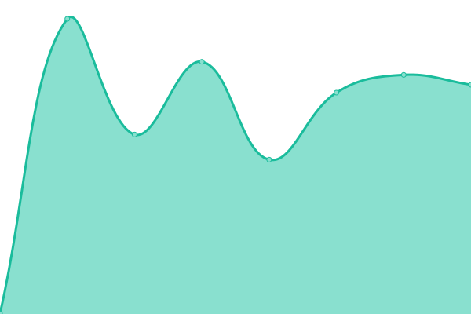

# [📈 Live Status](https://status.dink.cf): <!--live status--> **🟧 Partial outage**

This repository contains the open-source uptime monitor and status page for [Moonlight Studios](https://url.dink.cf/), powered by [Upptime](https://github.com/upptime/upptime).

With [Upptime](https://upptime.js.org), you can get your own unlimited and free uptime monitor and status page, powered entirely by a GitHub repository. We use [Issues](https://github.com/MoonlightStudiosInt/status/issues) as incident reports, [Actions](https://github.com/MoonlightStudiosInt/status/actions) as uptime monitors, and [Pages](https://status.dink.cf) for the status page.

<!--start: status pages-->
<!-- This summary is generated by Upptime (https://github.com/upptime/upptime) -->
<!-- Do not edit this manually, your changes will be overwritten -->
<!-- prettier-ignore -->
| URL | Status | History | Response Time | Uptime |
| --- | ------ | ------- | ------------- | ------ |
|  [Waddle Penguins Island - Website](https://waddlepenguins.me/) | 🟩 Up | [waddle-penguins-island-website.yml](https://github.com/MoonlightStudiosInt/status/commits/HEAD/history/waddle-penguins-island-website.yml) | 

 229ms
     
 | 

<a href="https://status.dink.cf/history/waddle-penguins-island-website">100.00%</a>
    

|  [Waddle Penguins Island - API](https://api.waddlepenguins.me/) | 🟩 Up | [waddle-penguins-island-api.yml](https://github.com/MoonlightStudiosInt/status/commits/HEAD/history/waddle-penguins-island-api.yml) | 

 1383ms
     
 | 

<a href="https://status.dink.cf/history/waddle-penguins-island-api">92.09%</a>
    

|  Waddle Penguins Island - Game Server | 🟩 Up | [waddle-penguins-island-game-server.yml](https://github.com/MoonlightStudiosInt/status/commits/HEAD/history/waddle-penguins-island-game-server.yml) | 

 127ms
     
 | 

<a href="https://status.dink.cf/history/waddle-penguins-island-game-server">100.00%</a>
    

|  [Waddle Penguins Island - Content](https://cdn.waddlepenguins.me/) | 🟩 Up | [waddle-penguins-island-content.yml](https://github.com/MoonlightStudiosInt/status/commits/HEAD/history/waddle-penguins-island-content.yml) | 

 167ms
     
 | 

<a href="https://status.dink.cf/history/waddle-penguins-island-content">100.00%</a>
    

|  [Files 3 Server](https://files3.dink.cf/) | 🟩 Up | [files-3-server.yml](https://github.com/MoonlightStudiosInt/status/commits/HEAD/history/files-3-server.yml) | 

 437ms
     
 | 

<a href="https://status.dink.cf/history/files-3-server">100.00%</a>
    

|  [Edge CDN](https://edge-cdn.dink.cf/) | 🟩 Up | [edge-cdn.yml](https://github.com/MoonlightStudiosInt/status/commits/HEAD/history/edge-cdn.yml) | 

 502ms
     
 | 

<a href="https://status.dink.cf/history/edge-cdn">100.00%</a>
    

|  [Files 5 Server](https://files5.dink.cf/) | 🟩 Up | [files-5-server.yml](https://github.com/MoonlightStudiosInt/status/commits/HEAD/history/files-5-server.yml) | 

 431ms
     
 | 

<a href="https://status.dink.cf/history/files-5-server">100.00%</a>
    

|  [Archive](https://archive.dink.cf/) | 🟩 Up | [archive.yml](https://github.com/MoonlightStudiosInt/status/commits/HEAD/history/archive.yml) | 

 618ms
     
 | 

<a href="https://status.dink.cf/history/archive">100.00%</a>
    

|  [EXT CDN](https://cdn.ext.dink.cf/) | 🟥 Down | [ext-cdn.yml](https://github.com/MoonlightStudiosInt/status/commits/HEAD/history/ext-cdn.yml) | 

 200ms
     
 | 

<a href="https://status.dink.cf/history/ext-cdn">0.00%</a>
    

|  [Club Penguin Atake - Website](https://cpatake.dink.cf/) | 🟩 Up | [club-penguin-atake-website.yml](https://github.com/MoonlightStudiosInt/status/commits/HEAD/history/club-penguin-atake-website.yml) | 

 303ms
     
 | 

<a href="https://status.dink.cf/history/club-penguin-atake-website">100.00%</a>
    

|  [Club Penguin Atake - AS1](https://as1-cpa.dink.cf/) | 🟩 Up | [club-penguin-atake-as-1.yml](https://github.com/MoonlightStudiosInt/status/commits/HEAD/history/club-penguin-atake-as-1.yml) | 

 357ms
     
 | 

<a href="https://status.dink.cf/history/club-penguin-atake-as-1">100.00%</a>
    

|  [Club Penguin Atake - AS2](https://as2-cpa.dink.cf/) | 🟩 Up | [club-penguin-atake-as-2.yml](https://github.com/MoonlightStudiosInt/status/commits/HEAD/history/club-penguin-atake-as-2.yml) | 

 294ms
     
 | 

<a href="https://status.dink.cf/history/club-penguin-atake-as-2">100.00%</a>
    

|  [Club Penguin Atake - AS3](https://as3-cpa.dink.cf/) | 🟩 Up | [club-penguin-atake-as-3.yml](https://github.com/MoonlightStudiosInt/status/commits/HEAD/history/club-penguin-atake-as-3.yml) | 

 358ms
     
 | 

<a href="https://status.dink.cf/history/club-penguin-atake-as-3">100.00%</a>
    

|  [Club Penguin Atake - Client 4.1](https://butterfly-cpa.dink.cf/) | 🟩 Up | [club-penguin-atake-client-4-1.yml](https://github.com/MoonlightStudiosInt/status/commits/HEAD/history/club-penguin-atake-client-4-1.yml) | 

 241ms
     
 | 

<a href="https://status.dink.cf/history/club-penguin-atake-client-4-1">100.00%</a>
    

|  [Club Penguin Atake - Web Client](https://web.cpatake.dink.cf/) | 🟩 Up | [club-penguin-atake-web-client.yml](https://github.com/MoonlightStudiosInt/status/commits/HEAD/history/club-penguin-atake-web-client.yml) | 

 242ms
     
 | 

<a href="https://status.dink.cf/history/club-penguin-atake-web-client">100.00%</a>
    

|  [Club Penguin Atake TV](https://cpataketv.dink.cf/) | 🟩 Up | [club-penguin-atake-tv.yml](https://github.com/MoonlightStudiosInt/status/commits/HEAD/history/club-penguin-atake-tv.yml) | 

 257ms
     
 | 

<a href="https://status.dink.cf/history/club-penguin-atake-tv">100.00%</a>
    

|  [Club Penguin Atake Radio](https://www.cpatake.dink.cf/radio/) | 🟩 Up | [club-penguin-atake-radio.yml](https://github.com/MoonlightStudiosInt/status/commits/HEAD/history/club-penguin-atake-radio.yml) | 

 221ms
     
 | 

<a href="https://status.dink.cf/history/club-penguin-atake-radio">100.00%</a>
    

|  [Club Penguin Atake E-Reader](https://www.cpatake.dink.cf/reader/) | 🟥 Down | [club-penguin-atake-e-reader.yml](https://github.com/MoonlightStudiosInt/status/commits/HEAD/history/club-penguin-atake-e-reader.yml) | 

 124ms
     
 | 

<a href="https://status.dink.cf/history/club-penguin-atake-e-reader">0.00%</a>
    

|  [Club Penguin Atake TV Video CDN](https://cdn.cpataketv.dink.cf/) | 🟩 Up | [club-penguin-atake-tv-video-cdn.yml](https://github.com/MoonlightStudiosInt/status/commits/HEAD/history/club-penguin-atake-tv-video-cdn.yml) | 

 103ms
     
 | 

<a href="https://status.dink.cf/history/club-penguin-atake-tv-video-cdn">100.00%</a>
    

|  [Club Penguin Atake Radio Audio CDN](https://cdn.media-radio.cpatake.tk/) | 🟩 Up | [club-penguin-atake-radio-audio-cdn.yml](https://github.com/MoonlightStudiosInt/status/commits/HEAD/history/club-penguin-atake-radio-audio-cdn.yml) | 

 168ms
     
 | 

<a href="https://status.dink.cf/history/club-penguin-atake-radio-audio-cdn">100.00%</a>
    

|  [Club Penguin Atake Radio Audio CDN](https://cdn.media-radio.cpatake.tk/) | 🟩 Up | [club-penguin-atake-radio-audio-cdn.yml](https://github.com/MoonlightStudiosInt/status/commits/HEAD/history/club-penguin-atake-radio-audio-cdn.yml) | 

 168ms
     
 | 

<a href="https://status.dink.cf/history/club-penguin-atake-radio-audio-cdn">100.00%</a>
    

|  [Club Penguin Atake E-Reader Books CDN](https://cdn.books.cpatake.tk/) | 🟩 Up | [club-penguin-atake-e-reader-books-cdn.yml](https://github.com/MoonlightStudiosInt/status/commits/HEAD/history/club-penguin-atake-e-reader-books-cdn.yml) | 

 452ms
     
 | 

<a href="https://status.dink.cf/history/club-penguin-atake-e-reader-books-cdn">100.00%</a>
    

<!--end: status pages-->

[**Visit our status website →**](https://status.dink.cf)

## 📄 License

- Powered by: [Upptime](https://github.com/upptime/upptime)
- Code: [MIT](./LICENSE) © [Moonlight Studios](https://url.dink.cf/)
- Data in the `./history` directory: [Open Database License](https://opendatacommons.org/licenses/odbl/1-0/)
