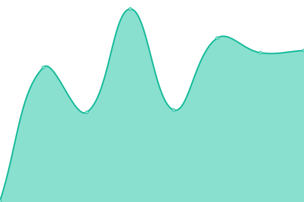
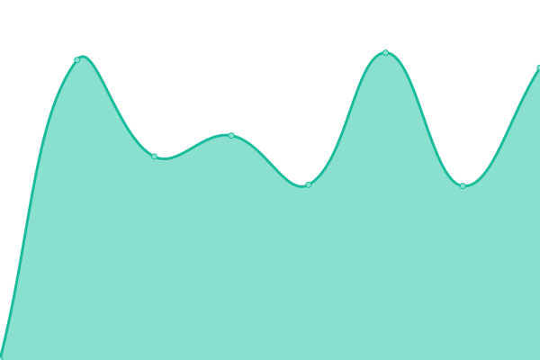

# [📈 Live Status](https://status.dink.cf): <!--live status--> **🟧 Partial outage**

This repository contains the open-source uptime monitor and status page for [Moonlight Studios](https://url.dink.cf/), powered by [Upptime](https://github.com/upptime/upptime).

With [Upptime](https://upptime.js.org), you can get your own unlimited and free uptime monitor and status page, powered entirely by a GitHub repository. We use [Issues](https://github.com/MoonlightStudiosInt/status/issues) as incident reports, [Actions](https://github.com/MoonlightStudiosInt/status/actions) as uptime monitors, and [Pages](https://status.dink.cf) for the status page.

<!--start: status pages-->
<!-- This summary is generated by Upptime (https://github.com/upptime/upptime) -->
<!-- Do not edit this manually, your changes will be overwritten -->
<!-- prettier-ignore -->
| URL | Status | History | Response Time | Uptime |
| --- | ------ | ------- | ------------- | ------ |
|  [Website](https://www.fullmoon.dev/) | 🟩 Up | [website.yml](https://github.com/fullmoondev/status/commits/HEAD/history/website.yml) | 

 225ms
     
 | 

<a href="https://status.fullmoon.dev/history/website">100.00%</a>
    

|  [Accounts](https://www.fullmoon.dev/accounts/) | 🟩 Up | [accounts.yml](https://github.com/fullmoondev/status/commits/HEAD/history/accounts.yml) | 

 74ms
     
 | 

<a href="https://status.fullmoon.dev/history/accounts">100.00%</a>
    

|  [Help Desk](https://www.fullmoon.dev/help/) | 🟩 Up | [help-desk.yml](https://github.com/fullmoondev/status/commits/HEAD/history/help-desk.yml) | 

 75ms
     
 | 

<a href="https://status.fullmoon.dev/history/help-desk">100.00%</a>
    

|  [Protected](https://protected.fullmoon.dev/) | 🟩 Up | [protected.yml](https://github.com/fullmoondev/status/commits/HEAD/history/protected.yml) | 

 501ms
     
 | 

<a href="https://status.fullmoon.dev/history/protected">100.00%</a>
    

|  [One Live ID Service](https://id.live.net.co/) | 🟩 Up | [one-live-id-service.yml](https://github.com/fullmoondev/status/commits/HEAD/history/one-live-id-service.yml) | 

 323ms
     
 | 

<a href="https://status.fullmoon.dev/history/one-live-id-service">100.00%</a>
    

|  [Profile API](https://profile.live.net.co/info) | 🟩 Up | [profile-api.yml](https://github.com/fullmoondev/status/commits/HEAD/history/profile-api.yml) | 

 314ms
     
 | 

<a href="https://status.fullmoon.dev/history/profile-api">100.00%</a>
    

|  [Online Live Service API](https://ols.live.net.co/info) | 🟩 Up | [online-live-service-api.yml](https://github.com/fullmoondev/status/commits/HEAD/history/online-live-service-api.yml) | 

 325ms
     
 | 

<a href="https://status.fullmoon.dev/history/online-live-service-api">100.00%</a>
    

|  [Live Store Website](https://www.fullmoon.dev/apollo/) | 🟩 Up | [live-store-website.yml](https://github.com/fullmoondev/status/commits/HEAD/history/live-store-website.yml) | 

 152ms
     
 | 

<a href="https://status.fullmoon.dev/history/live-store-website">100.00%</a>
    

|  [Live Store Dev Center](https://store-dev.live.net.co/) | 🟥 Down | [live-store-dev-center.yml](https://github.com/fullmoondev/status/commits/HEAD/history/live-store-dev-center.yml) | 

 1310ms
     
 | 

<a href="https://status.fullmoon.dev/history/live-store-dev-center">99.99%</a>
    

|  [Live Store Assets](https://apollo.fullmoon.dev/) | 🟩 Up | [live-store-assets.yml](https://github.com/fullmoondev/status/commits/HEAD/history/live-store-assets.yml) | 

 277ms
     
 | 

<a href="https://status.fullmoon.dev/history/live-store-assets">100.00%</a>
    

|  [Live Store API](https://store-api.live.net.co/info) | 🟩 Up | [live-store-api.yml](https://github.com/fullmoondev/status/commits/HEAD/history/live-store-api.yml) | 

 327ms
     
 | 

<a href="https://status.fullmoon.dev/history/live-store-api">100.00%</a>
    

|  [Live Store Ruby CDN](https://ruby.cdn.apollo.fullmoon.dev/) | 🟩 Up | [live-store-ruby-cdn.yml](https://github.com/fullmoondev/status/commits/HEAD/history/live-store-ruby-cdn.yml) | 

 276ms
     
 | 

<a href="https://status.fullmoon.dev/history/live-store-ruby-cdn">100.00%</a>
    

|  [Live Store CDN1](https://livestore1.cdn.dink.cf/) | 🟩 Up | [live-store-cdn-1.yml](https://github.com/fullmoondev/status/commits/HEAD/history/live-store-cdn-1.yml) | 

 228ms
     
 | 

<a href="https://status.fullmoon.dev/history/live-store-cdn-1">100.00%</a>
    

|  [Global Assets](https://assets.fullmoon.dev/) | 🟩 Up | [global-assets.yml](https://github.com/fullmoondev/status/commits/HEAD/history/global-assets.yml) | 

 208ms
     
 | 

<a href="https://status.fullmoon.dev/history/global-assets">100.00%</a>
    

|  [Global CDN](https://edge.live.net.co/) | 🟩 Up | [global-cdn.yml](https://github.com/fullmoondev/status/commits/HEAD/history/global-cdn.yml) | 

 200ms
     
 | 

<a href="https://status.fullmoon.dev/history/global-cdn">100.00%</a>
    

|  [Club Penguin Atake - Website](https://www.cpatake.boo/) | 🟩 Up | [club-penguin-atake-website.yml](https://github.com/fullmoondev/status/commits/HEAD/history/club-penguin-atake-website.yml) | 

 289ms
     
 | 

<a href="https://status.fullmoon.dev/history/club-penguin-atake-website">100.00%</a>
    

|  [Club Penguin Atake - AS1](https://as1.cpatake.boo/) | 🟩 Up | [club-penguin-atake-as-1.yml](https://github.com/fullmoondev/status/commits/HEAD/history/club-penguin-atake-as-1.yml) | 

 227ms
     
 | 

<a href="https://status.fullmoon.dev/history/club-penguin-atake-as-1">34.35%</a>
    

|  [Club Penguin Atake - AS2](https://as2.cpatake.boo/) | 🟩 Up | [club-penguin-atake-as-2.yml](https://github.com/fullmoondev/status/commits/HEAD/history/club-penguin-atake-as-2.yml) | 

 209ms
     
 | 

<a href="https://status.fullmoon.dev/history/club-penguin-atake-as-2">34.36%</a>
    

|  [Club Penguin Atake - AS3](https://as3.cpatake.boo/) | 🟩 Up | [club-penguin-atake-as-3.yml](https://github.com/fullmoondev/status/commits/HEAD/history/club-penguin-atake-as-3.yml) | 

 328ms
     
 | 

<a href="https://status.fullmoon.dev/history/club-penguin-atake-as-3">34.38%</a>
    

|  [Club Penguin Atake - App](https://app.cpatake.boo/) | 🟩 Up | [club-penguin-atake-app.yml](https://github.com/fullmoondev/status/commits/HEAD/history/club-penguin-atake-app.yml) | 

 239ms
     
 | 

<a href="https://status.fullmoon.dev/history/club-penguin-atake-app">100.00%</a>
    

|  [Club Penguin Atake TV](https://tv.cpatake.boo/) | 🟩 Up | [club-penguin-atake-tv.yml](https://github.com/fullmoondev/status/commits/HEAD/history/club-penguin-atake-tv.yml) | 

 223ms
     
 | 

<a href="https://status.fullmoon.dev/history/club-penguin-atake-tv">100.00%</a>
    

|  [Club Penguin Atake Web Services](https://usmo-cfc.cpatake.boo) | 🟩 Up | [club-penguin-atake-web-services.yml](https://github.com/fullmoondev/status/commits/HEAD/history/club-penguin-atake-web-services.yml) | 

 253ms
     
 | 

<a href="https://status.fullmoon.dev/history/club-penguin-atake-web-services">34.21%</a>
    

|  [Club Penguin Atake TV - Video CDN](https://cdn.tv.cpatake.boo/) | 🟩 Up | [club-penguin-atake-tv-video-cdn.yml](https://github.com/fullmoondev/status/commits/HEAD/history/club-penguin-atake-tv-video-cdn.yml) | 

 65ms
     
 | 

<a href="https://status.fullmoon.dev/history/club-penguin-atake-tv-video-cdn">80.02%</a>
    

|  [Club Penguin Atake - Legacy CDN](https://legacy.cdn.cpatake.tk/) | 🟩 Up | [club-penguin-atake-legacy-cdn.yml](https://github.com/fullmoondev/status/commits/HEAD/history/club-penguin-atake-legacy-cdn.yml) | 

 259ms
     
 | 

<a href="https://status.fullmoon.dev/history/club-penguin-atake-legacy-cdn">34.40%</a>
    

|  [Club Penguin Atake - Vanilla CDN](https://vanilla.cdn.cpatake.tk/) | 🟩 Up | [club-penguin-atake-vanilla-cdn.yml](https://github.com/fullmoondev/status/commits/HEAD/history/club-penguin-atake-vanilla-cdn.yml) | 

 279ms
     
 | 

<a href="https://status.fullmoon.dev/history/club-penguin-atake-vanilla-cdn">100.00%</a>
    

|  [Club Penguin Atake - Antique CDN](https://antique.cdn.cpatake.tk/) | 🟩 Up | [club-penguin-atake-antique-cdn.yml](https://github.com/fullmoondev/status/commits/HEAD/history/club-penguin-atake-antique-cdn.yml) | 

 318ms
     
 | 

<a href="https://status.fullmoon.dev/history/club-penguin-atake-antique-cdn">34.65%</a>
    

|  [Club Penguin Atake - Experimental Penguins](https://ep.cpatake.boo/) | 🟩 Up | [club-penguin-atake-experimental-penguins.yml](https://github.com/fullmoondev/status/commits/HEAD/history/club-penguin-atake-experimental-penguins.yml) | 

 242ms
     
 | 

<a href="https://status.fullmoon.dev/history/club-penguin-atake-experimental-penguins">34.43%</a>
    

|  [Club Penguin Atake - Penguin Chat](https://pc.cpatake.boo/) | 🟩 Up | [club-penguin-atake-penguin-chat.yml](https://github.com/fullmoondev/status/commits/HEAD/history/club-penguin-atake-penguin-chat.yml) | 

 271ms
     
 | 

<a href="https://status.fullmoon.dev/history/club-penguin-atake-penguin-chat">34.44%</a>
    

|  [Club Penguin Atake - Penguin Chat 3](https://pc3.cpatake.boo/) | 🟩 Up | [club-penguin-atake-penguin-chat-3.yml](https://github.com/fullmoondev/status/commits/HEAD/history/club-penguin-atake-penguin-chat-3.yml) | 

 178ms
     
 | 

<a href="https://status.fullmoon.dev/history/club-penguin-atake-penguin-chat-3">34.46%</a>
    

|  [Club Penguin Atake - Profile](https://profile.cpatake.boo/) | 🟩 Up | [club-penguin-atake-profile.yml](https://github.com/fullmoondev/status/commits/HEAD/history/club-penguin-atake-profile.yml) | 

 7107ms
     
 | 

<a href="https://status.fullmoon.dev/history/club-penguin-atake-profile">99.49%</a>
    

<!--end: status pages-->

[**Visit our status website →**](https://status.dink.cf)

## 📄 License

- Powered by: [Upptime](https://github.com/upptime/upptime)
- Code: [MIT](./LICENSE) © [Moonlight Studios](https://url.dink.cf/)
- Data in the `./history` directory: [Open Database License](https://opendatacommons.org/licenses/odbl/1-0/)
